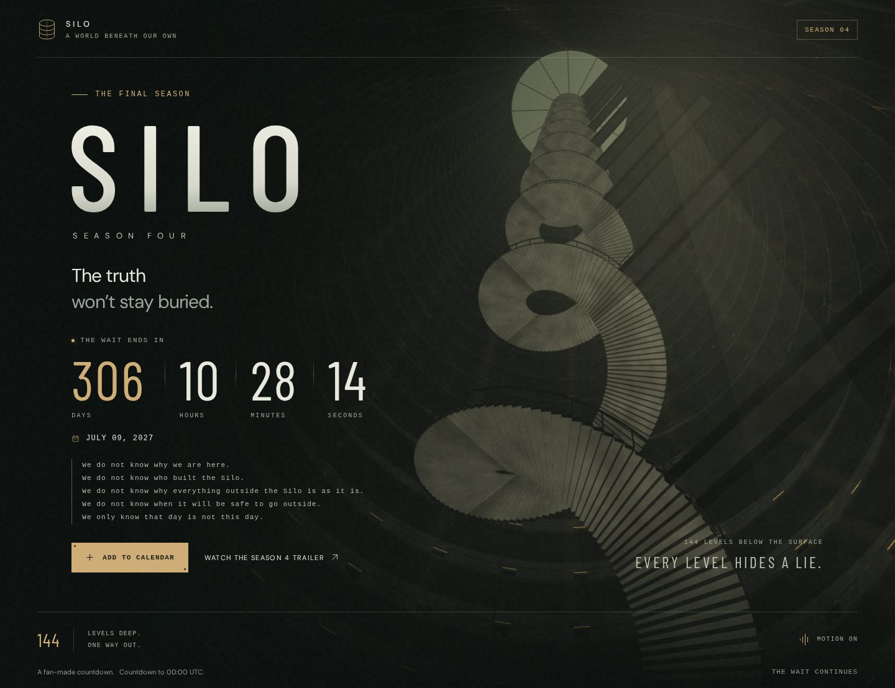

# Silo Season 4 Countdown

A fan-made countdown to the final season of *Silo*, premiering **July 9, 2027**.

**Live page:** https://anzhelaschults.github.io/silo-countdown/

## What it is

A single, self-contained `index.html` — no build step, no dependencies, no tracking. The page renders a procedural 3D silo in WebGL (with an SVG fallback), counts down live to the premiere, links to the official Season 4 trailer, and lets you add the date to Google Calendar. Motion respects `prefers-reduced-motion` and can be toggled off in the footer.

Typography: Barlow Condensed and DM Sans, embedded under the SIL Open Font License 1.1.

## Running it locally

Open `index.html` in any browser. That's it.

## Deploying

The repository is published with GitHub Pages from the `main` branch. Any change pushed to `index.html` goes live automatically.

## Credits

Original page by Rasmus Schults; redesign and deployment by Anzhela Schults. Not affiliated with the show's producers or distributors. The countdown targets 00:00 UTC on the premiere date.
